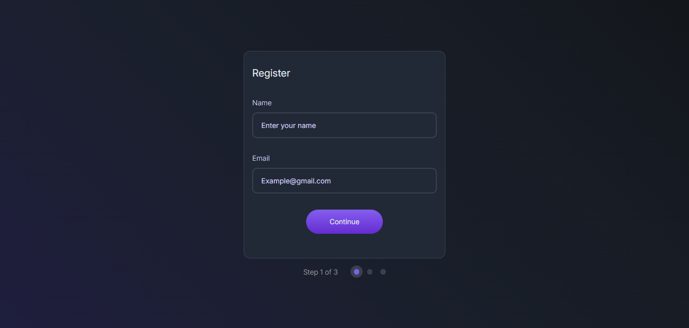

<!-- Please update value in the {}  -->

<h1 align="center">Multi Step Regiister Form | devChallenges</h1>

   Solution for a challenge <a href="https://devchallenges.io/challenge/multi-step-register-form" target="_blank">Multi-step Register Form</a> from <a href="http://devchallenges.io" target="_blank">devChallenges.io</a>.

  <h3>
    <a href="https://gustavo2023.github.io/multi-step-register-form/">
      Demo
    </a>
     | 
    <a href="{https://your-url-to-the-solution}">
      Solution
    </a>
     | 
    <a href="https://devchallenges.io/challenge/multi-step-register-form">
      Challenge
    </a>
  </h3>

<!-- TABLE OF CONTENTS -->

## Table of Contents

- [Overview](#overview)
  - [What I learned](#what-i-learned)
- [Built with](#built-with)
- [Features](#features)

<!-- OVERVIEW -->

## Overview

This multi-step register form collects a user’s name, email, and a list of chosen “topics of interest” in three separate steps. The user navigates between steps with “Continue” buttons, while step circles visually indicate progress and allow navigating back to completed steps.

### What I learned

- **DOM Manipulation:** learned about using different DOM selectors to target specific elements in the HTML structure. This helps to dynamically generate elements like `<li>` in order to correctly display the topics of interest for the user and to uodate the summary elements (name, email) in the third step of the form.

- **Form Validation:** created a function that utilizes regex to confirm a valid email address. I used conditionals to verify that the user filled the necassary input fields before advancing to the next step.

### Built with

- Semantic HTML5 markup
- CSS custom properties
- Flexbox

## Features

- **Multi-step Navigation**
- **Input Validation**
- **Final Confirmation Alert**

This application/site was created as a submission to a [DevChallenges](https://devchallenges.io/challenges-dashboard) challenge.

## Author

- GitHub [@gustavo2023](https://github.com/gustavo2023)
